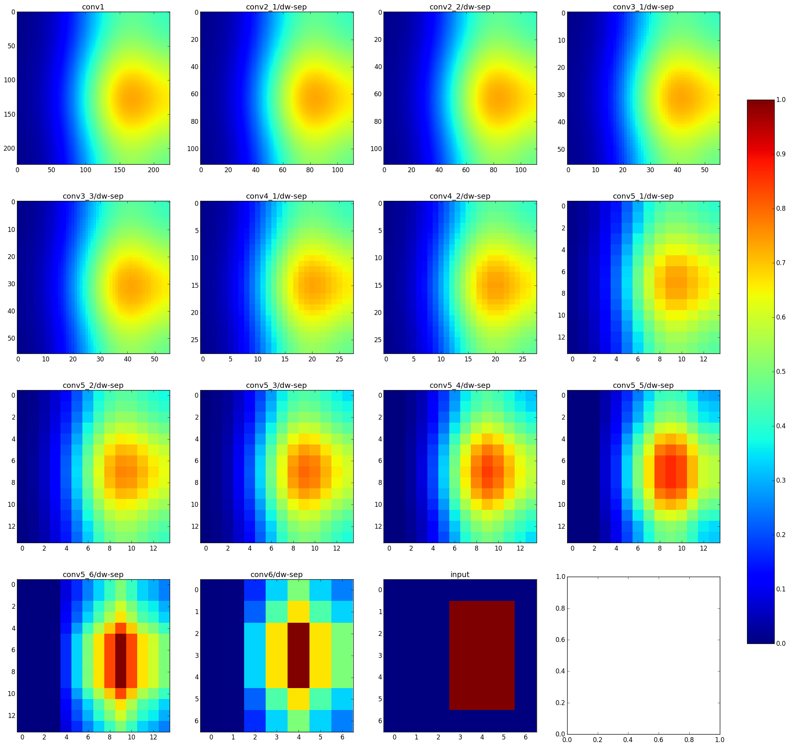

The purpose of these visualization scripts is to show how different parts of an image input contribute to the convolutional feature maps at each layer. For now, this is hardcoded to visualize [MobileNet-224](https://arxiv.org/pdf/1704.04861.pdf) but, in principle, any network that has convolutional feature maps could be visualized by declaring the layers in the same format as `mobilenet_layers`.

Usage: `python viz.py [mode] [layer] [img_height] [img_width] [crop_x] [crop_y] [crop_w] [crop_y] [show_image] [video/img_path] [frame_no]`

The two types of visualization here are the `forward` and `backward` modes.

`forward` takes a crop in the input image and applies an averaging [box filter](https://en.wikipedia.org/wiki/Box_blur) of equivalent size to each convolutional filter. Each element of the output feature maps is a value between 0 and 1, which can be thought of as the fractional contribution of the subject of interest to this particular output. All of the layers up to and including `layer` are computed and displayed.

`backward` fixes a layer in the network and proceeds in reverse, applying deconvolutional filters of equal size to the conv filters at each layer. The output values reflect how important each part of the feature maps and input image are to creating the values in the selected layer.

One invocation of `viz.py` creates two images. The first (`conv_maps.png`) displays the fractional value as is, and can be displayed as either a heatmap or a weighted version of the original image. The second (`conv_maps_ratio.png`) also applies the convolutions to the complement of the input image and and computes a fraction of the "inside" pixels over the sum of the "inside" and "outside" pixels. It might help to illustrate this with an example.

Running the command
```
python viz.py forward conv6/dw-sep 224 224 144 64 64 144 noshow ~/Downloads/train_cam_full.mp4 30000
```
yields the following two outputs (`conv_maps` followed by `conv_maps_ratio` in that order):


As you can see, they look roughly the same other than somewhat different behavior towards the edges. This is due to the following reason. Although the absolute number of subject pixels that contribute to the edges of the feature maps are lower than those in the center, the number of "outside" pixels that contribute is also substantially lower! The benefit of the fractional visualization (as I see it) is that it displays the "signal-to-noise ratio" in a very rough sense, while the normal visualization just tells how much signal is present at that point.

So far, the `backward` visualization has not been quite as informative but is still useful for getting a rough idea of how different parts of the image contribute. Running the command 
```
python viz.py backward conv6/dw-sep 7 7 3 1 3 5 show ~/Downloads/train_cam_full.mp4 30000
```
yields the following `conv_maps` and `conv_maps_ratio` diagrams.



This shows that choosing a crop of a later feature map generally has contribution from the "corresponding" part of the image, but incorporates a fair amount of external information as well. If one is aiming to use these features for their "spatial localization" properties, it's important to consider how to trade-off the degree of localization against the "semantic level" of the features as one proceeds through the network.
